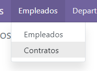
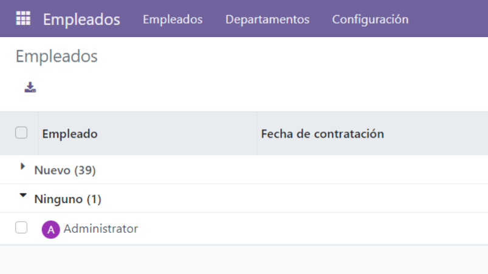
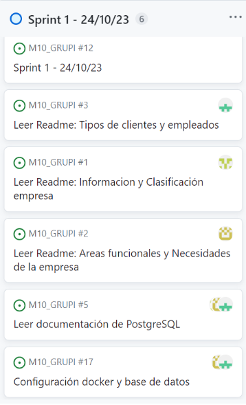
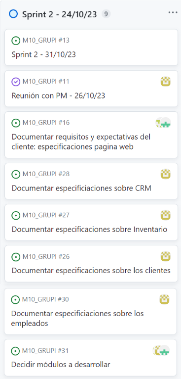
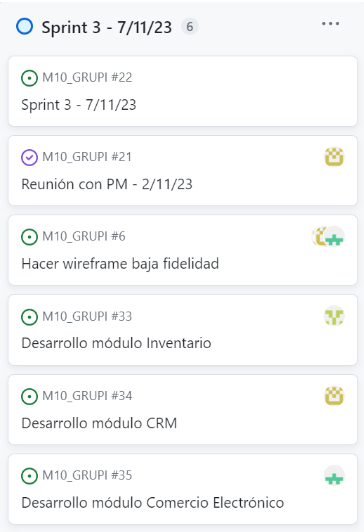
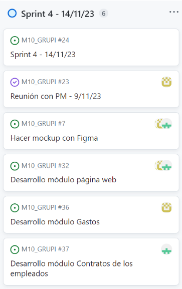
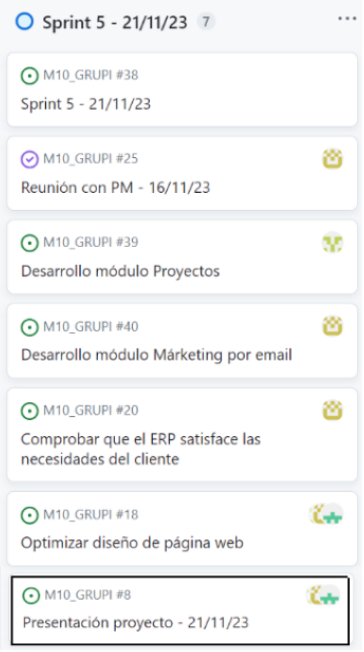

# Esperanza Solidaria

 

### Índice:

1. [Descripción empresa](#1-descripción-empresa)
2. [Objetivos y necesidades](#2-objetivos-y-necesidades)
3. [Módulos](#3-módulos)
4. [Backlog](#4-backlog)
5. [Reuniones semanales](#5-reuniones-semanales)
6. [Protoipo Horizontal de baja fidelidad](#6-prototipo-horizontal-de-baja-fidelidad)
7. [Protoipo Horizontal de alta fidelidad](#7-prototipo-horizontal-de-alta-fidelidad)
8. [Conclusiones](#8-conclusiones)

 

## 1-Descripción empresa

Esperanza Solidaria, es una organización del Tercer Sector comprometida con la asistencia humanitaria.

Es una entidad con un enfoque regional y un tamaño mediano, sin animo de lucro que se sustenta principalmente a través de donaciones y ayudas ofrecidas por individuos y empresas.

Su viabilidad financiera depende de las donaciones de particulares y empresas, que constituyen una parte crucial de su presupuesto y que les permite desarrollar los proyectos y programas sociales que llevan a cabo en la comunidad de Madrid.

Dicha organización se enfoca en reclutar y capacitar a voluntarios comprometidos con la inclusión social en la provincia de Madrid. 
Estos voluntarios desempeñan un papel vital en todas las áreas de trabajo. 

  

## 2-Objetivos y necesidades

El objetivo principal al que esta enfocada Esperanza Solidaria es brindar asistencia integral a la mayor cantidad de personas posible. 

Como objetivo a corto plazo buscan ser una red de ayuda para cualquier individuo o familia en la comunidad de Madrid. 

A largo plazo, buscan establecer varios centros de apoyo en cada comunidad autónoma de Espaaña, que funcionen como puntos estratégicos para el desarrollo óptimo de los proyectos que se vayan a implementar.

Para cumplir dichos objetivos, existen una serie de necesidades planteadas por la empresa:

- Optimizar la gestión del personal y voluntariado, a la vez que su contratación.

- Supervisar y evaluar la implementación de programas de ayuda para asegurar su eficacia y alineación con la misión de la ONG.

- Coordinar efizcamente las actividad de voluntariado, asignándolos a proyectos según sus habilidades y la necesidad de la organización.

- Desarrollar estrategias efectivas de promoción y captación de recursos para aumentar la visibilidad y el apoyo financiero.

- Lanzar campañas de concienciación que sensibilicen a la comunidad sobre los desafíos enfrentados por la población que asistimos.

- Planificar y ejecutar eventos que generen fondos de manera efectiva, involucrando a la comunidad y donantes potenciales.

- Mantener un inventario actualizado de las donaciones.

- Venta de productos propios para conseguir recaudación enfocada en el desarrollo de proyectos.

  

## 3-Módulos

La elección de los módulos de Odoo esta enfocada en abordar las necesidades específicas planteadas anteriormente y optimizar la gestión de la empresa.

 

### CRM:
El módulo CRM desempeñará un papel fundamental en la optimización de la gestión de relaciones con donantes, voluntarios y colaboradores de Esperanza Solidaria. 
Este sistema permitirá una administración eficiente de la información, mejorando la comunicación y fortaleciendo las relaciones con todas las partes involucradas. A continuación, se detallan sus funcionalidades clave:

1. **Gestión de donantes**:

    Registro detallado de donantes individuales y empresas colaboradoras.
    Seguimiento de donaciones y generación de informes para evaluar el apoyo financiero.

2. **Voluntarios y personal**:

    Perfiles de voluntarios con habilidades y experiencia detalladas.
    Seguimiento de la disponibilidad y asignación eficiente a proyectos según las necesidades.

3. **Seguimiento de programas y proyectos**:

    Registro de programas y proyectos en curso.
    Evaluación continua para asegurar la alineación con la misión de la organización.

4. **Interacción y comunicación**:

    Registro de interacciones con donantes, voluntarios y colaboradores.
    Herramientas de comunicación integradas para mantener a todos informados sobre los avances y logros.

5. **Análisis y reportes**:

    Generación de informes para evaluar la eficacia de las campañas de concienciación y captación de recursos.
    Seguimiento de la participación en eventos y respuesta a campañas.

  

### Página Web
Primordial para la promoción y captación de recursos. Se desarrolla un sitio web intuitivo y atractivo que destaque los proyectos de la empresa y facilite las donaciones en línea, además de la captación de futuros voluntarios.

Entendemos que las necesidades de la organización pueden cambiar con el tiempo, y queremos asegurarnos de que su presencia en línea siempre esté alineada con su evolución. Así que, si en algún momento desean realizar cambios, ya sea actualizar información, agregar nuevas secciones o incluso cambiar el diseño visual, dicho modulo nos prepara para hacerlo realidad sin complicaciones.

Con este módulo, podrán tener una presencia en línea que refleje verdaderamente la labor que realizan. Este sitio web no solo será un recurso informativo, sino también una herramienta para conectar con su comunidad y atraer a nuevos seguidores y donantes. Alguno de los beneficios que se pueden encontrar són:   

1. **Recopilación de fondos:**

    Facilita la recaudación de fondos al proporcionar formularios de donación integrados.

2. **Comunicación:**   
    Facilita la comunicación efectiva mediante la publicación de noticias, actualizaciones y eventos que mantienen a la comunidad informada sobre las actividades de la ONG.

3. **Voluntariado y Colaboración:**
    Permite la promoción de oportunidades de voluntariado y colaboración, facilitando la participación activa de personas interesadas en contribuir con su tiempo y habilidades.

4. **Tiendas Solidarias:**
    Para ONGs que participan en comercio justo o tienen tiendas solidarias, la página web puede ser una plataforma para vender productos y recaudar fondos.

  

### Inventario
Con esta herramienta podemos coordinar la distribución de alimentos, ropa y futuros artículos que puedan existir. 
Se implementa un sistema de inventario para garantizar un seguimiento de las donaciones de productos y facilitar su distribución según las necesidades.

Los beneficios que podemos encontrar son los siguientes: 

1. **Gestión Eficiente de Recursos:**   
Permite un seguimiento detallado de los recursos disponibles, incluyendo alimentos, suministros médicos, ropa, etc.

2. **Optimización de Inventario:**   
Ayuda a evitar el exceso o la falta de existencias al proporcionar información en tiempo real sobre los niveles de inventario.

3. **Colaboración y Comunicación Mejoradas:**   
Mejora la comunicación interna al proporcionar a todos los miembros del equipo una visión común del inventario y los proyectos asociados.

4. **Adaptabilidad y Escalabilidad:**   
Odoo es un sistema escalable que puede adaptarse al crecimiento de la organización y a la expansión de proyectos.
Proporciona flexibilidad para agregar nuevos productos, ubicaciones de almacenamiento y funciones según sea necesario.

  

### Marketing por Email
Herramienta efectiva para sensibilizar a la comunidad y presentar campañas de concienciación. Este módulo permite el diseño y la ejecución de campañas de manera eficaz, con el objetivo de llegar a la máxima audiencia posible.

El propósito principal de implementar el módulo de marketing por email es mejorar la comunicación con donantes, voluntarios y la comunidad en general.  A continuación se detallan sus características clave:

1. **Creación de campañas personalizadas**:
    
    Permite diseñar y enviar correos electrónicos personalizados a segmentos específicos de la audiencia.

2. **Automatización de flujos de trabajo**:

    Configuración de flujos automáticos para enviar correos de agradecimiento, confirmaciones y recordatorios.

3. **Seguimiento y análisis**:

    Proporciona métricas detalladas para evaluar el rendimiento de las campañas.

4. **Segmentación de audiencia**:

    División de contactos en grupos específicos (donantes, voluntarios, intereses) para mensajes personalizados y dirigidos.

5. **Contenido relevante y persuasivo**:

    Creación de contenido atractivo y persuasivo para transmitir el impacto real de las contribuciones y la importancia de la participación.

6. **Automatización de campañas**:

    Configuración de flujos automáticos para enviar correos de agradecimiento, actualizaciones de proyectos y recordatorios de eventos.

  

### Empleados
Para la gestión de los empleados, se debe tener su información, conectarlos con la empresa, generar sus contratos. Posicionarlos en los departamentos de la ONG. Primero se deciden los diferentes departamentos que va a constituir la empresa y después se añade el personal con una función dentro de ese departamento. Cada empleado tiene una función y el departamento puede variar en número de roles y de funciones. Se mantiene la coherencia y la lógica entre estos. 

  

### Contrato de los empleados
Para asegurarse de mantener la legalidad y la transparencia de los empleados y de sus funciones en la empresa, hay que tener un contrato suyo existente que esté bien documentado. Su fecha de inicio, su fecha de fin, su sueldo, tiene que estar incluido en el contrato. 

No puede haber un empleado sin contrato, Odoo tiene una opción para ver todos los contratos generados en una página, sin tener que acceder a ellos a través de los empleados. De esta forma el empleado que no tiene contrato aparece en la parte de "ninguno", se clica sobre él/ella y se completa la acción.
 

  

### Gastos
La gestión detallada de gastos es esencial para garantizar la transparencia y la responsabilidad en el manejo de los recursos. Esto no solo implica llevar un registro de cada desembolso, sino también asegurarse de que cada gasto esté alineado con los objetivos humanitarios y sociales de la organización. 

Registrar y documentar adecuadamente los gastos a través de este módulo puede ayudar a Esperanza Solidaria de varias maneras:

1. **Transparencia financiera**: Facilita la transparencia al mostrar a donantes, colaboradores y socios cómo se manejan y distribuyen los fondos.

2. **Seguimiento de recursos**: Permite un seguimiento detallado de cómo se gastan los fondos, lo que ayuda a tomar decisiones financieras más informadas y eficientes.

3. **Informes y justificación**: Proporciona la base para informes financieros detallados y ayuda a justificar el uso de fondos a los donantes y a las autoridades correspondientes.

4. **Eficiencia en la gestión**: Al tener una visión clara de los gastos, se puede identificar áreas de mejora en la gestión financiera y optimizar los recursos disponibles.

5. **Transparencia y confianza**: Aumenta la confianza de los donantes y el público en general al demostrar una gestión responsable y transparente de los recursos financieros.

  

### Proyecto
Garantiza que todas las actividades, decisiones y programas implementados estén en consonancia con la misión y los valores fundamentales de la organización.
Las razones claves de su uso son las siguientes:

1. **Planificación:**   
Facilita la planificación detallada de proyectos, incluyendo tareas, plazos y recursos necesarios.    

2. **Seguimiento del progreso:**   
Permite realizar un seguimiento de tareas y actividades para garantizar que el proyecto avance según lo planificado. 

3. **Colaboración:**   
Mejora la colaboración entre los miembros del equipo al proporcionar un espacio centralizado para compartir información y documentos relacionados con el proyecto.

4. **Gestión de Riesgos:**   
Permite la identificación y gestión proactiva de riesgos asociados con cada proyecto.

  

### Comercio Electrónico

Permite al usuario que visite la página a obtener productos solidarios y de esta forma se contribuye a la recaudación de fondos.  Con esto, la empresa es promocionada y puede beneficiarse para llevar a cabo próximos proyectos.  

   

## 4-Backlog

A continuación, presentamos el primer backlog, hecho sin reuinión previa y solamente teniendo en cuenta el documento que se nos entregó con información de la empresa.
  

  
 

Después de la primera reunión realizada, conseguimos definir los módulos que ibamos a implementar y agregamos las siguientes tareas a nuestro backlog:
  

  

## 5-Reuniones semanales

La entrevista inicial con nuestro cliente se llevó a cabo el 19/10/23. Desde entonces, hemos mantenido reuniones semanales para obtener su retroalimentación sobre el progreso del proyecto. En estas reuniones, hemos planificado un conjunto de tareas realistas para ser completadas antes de los respectivos plazos (sprints).

Estas responsabilidades se distribuyeron entre los miembros del equipo, sin embargo, siempre ha prevalecido una colaboración conjunta en las especificaciones, asegurándonos de que se realicen de manera unánime.

A continuación, se detalla el progreso alcanzado en cada sprint:

En el Sprint de la primera semana, nos focalizamos en entender con que tipo de empresa ibamos a trabajar, por dicho motivo, hubo mucha tarea de lectura para poder despues esquematizar correctamente como ibamos a trabajar y satisfacer las necesidades de la ONG.

 
   
---
 
En la segunda semana, presentamos los modulos que iban a satisfacer las necesidades más urgentes que tenia la empresa, teniendo en cuenta que su objetivo principal era hacerse más grande y poder llegar a trabajar por toda España.   
Por eso, los modulos que presentamos fueron los comentados anteriormente, los cuales fueron aceptados por el PM de Esperanza Solidaria.

   
---
 
Comenzamos a plantear una idea inicial de como seria la página web, teniendo en cuenta de que manera queria llegar Esperanza Solidaria a su público y que era lo que queria transmitir. Para esto, hicimos realizamos un wireframe de baja fidelidad que posteriormente fue aceptado por el PM para poder ir realizando el mockup. Por otro lado, iniciamos el desarrollo de los módulos que habiamos escogido anteriormente.

   
---
 
Iniciamos con el mockup en Figma, el cual fue aprobado y nos permitio hacer realidad la página web que habiamos acordado con el PM. Por otro lado, se finalizaron los modulos anteriores y se continuaron con unos nuevos.

   
---
    
Finalizamos la página web, siguiendo con la visión del PM de Esperanza Unida, y acabamos con los tres últimos módulos que teniamos pendiente. Todo esto nos permitio darles una visión general de como se estaba materializando la idea que nos habian presentado.
 
    

   

## 6-Prototipo Horizontal de baja fidelidad

https://www.figma.com/file/mscZSGHO2kCcRqtMJ3tWAe/Esperanza-Solidaria---Prototipo-horizontal-de-baja-fidelidad?type=design&node-id=0-1&mode=design&t=66ZLzJMIhWWEcKgj-0

  

## 7-Prototipo Horizontal de alta fidelidad

https://www.figma.com/file/RYGk0VBYQdVZobpOJ5Hkj0/Prototipo-horizontal-de-alta-fidelidad?type=design&node-id=0-1&mode=design&t=xo6gEHtPbeNJ1QS5-0

  

## 8-Conclusiones

La implementación de un ERP como Odoo en Esperanza Solidaria es una inversión estratégica. La plataforma ofrece herramientas integrales que no solo mejoran la eficiencia operativa, sino que también fortalecen la capacidad de la organización para alcanzar sus objetivos humanitarios con transparencia, eficacia y escalabilidad.

Estas conclusiones resaltan los beneficios significativos que esta herramienta aporta a Esperanza Solidaria, proporcionando una plataforma integral para optimizar sus operaciones, aumentar su impacto y promover su crecimiento sostenible en el ámbito humanitario.
