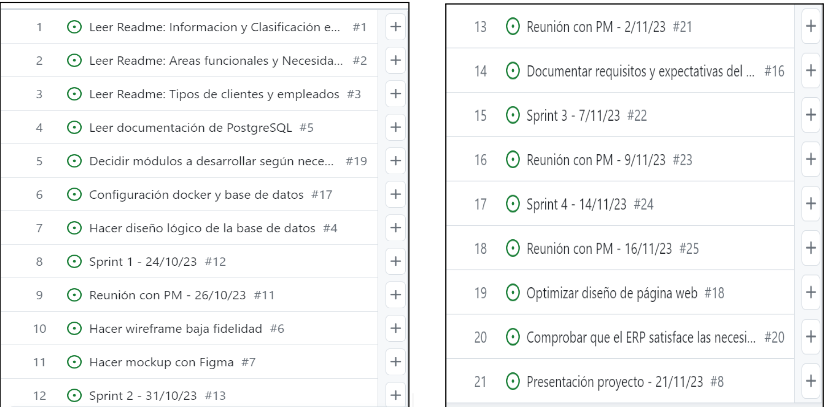
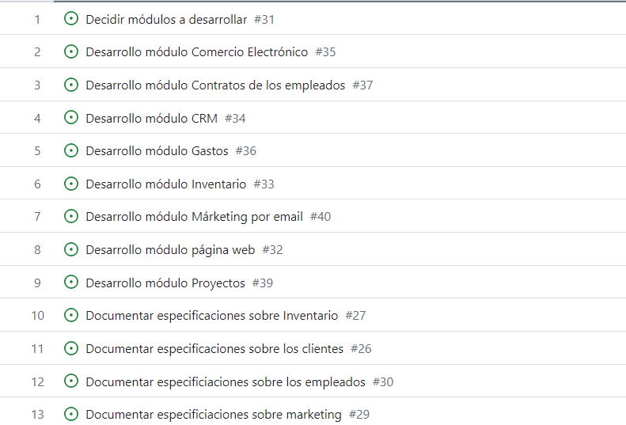

# Esperanza Solidaria

 

### Índice:

1. [Descripción empresa](#1-descripción-empresa)
2. [Objetivos y necesidades](#2-objetivos-y-necesidades)
3. [Módulos](#3-módulos)
4. [Backlog](#4-backlog)
5. [Reuniones semanales](#5-reuniones-semanales)
6. [Página web](#6-página-web)

  

## 1-Descripción empresa
 

Esperanza Solidaria, es una organización del Tercer Sector comprometida con la asistencia humanitaria.

Es una entidad con un enfoque regional y un tamaño mediano, sin animo de lucro que se sustenta principalmente a través de donaciones y ayudas ofrecidas por individuos y empresas. Su viabilidad financiera depende de las donaciones de particulares y empresas, que constituyen una parte crucial de su presupuesto y que les permite desarrollar los proyectos y programas sociales que llevan a cabo en la comunidad de Madrid.

Dicha organización se enfoca en reclutar y capacitar a voluntarios comprometidos con la inclusión social en la provincia de Madrid. 
Estos voluntarios desempeñan un papel vital en todas las áreas de trabajo. 

  

## 2-Objetivos y necesidades
 

El objetivo principal al que esta enfocada Esperanza Solidaria es brindar asistencia integral a la mayor cantidad de personas posible. 

Como objetivo a corto plazo buscan ser una red de ayuda para cualquier individuo o familia en la comunidad de Madrid. 

A largo plazo, buscan establecer varios centros de apoyo en cada comunidad autónoma de Espaaña, que funcionen como puntos estratégicos para el desarrollo óptimo de los proyectos que se vayan a implementar.

Para cumplir dichos objetivos, existen una serie de necesidades planteadas por la empresa:

- Optimizar la gestión del personal y voluntariado, a la vez que su contratación.

- Supervisar y evaluar la implementación de programas de ayuda para asegurar su eficacia y alineación con la misión de la ONG.

- Coordinar efizcamente las actividad de voluntariado, asignándolos a proyectos según sus habilidades y la necesidad de la organización.

- Desarrollar estrategias efectivas de promoción y captación de recursos para aumentar la visibilidad y el apoyo financiero.

- Lanzar campañas de concienciación que sensibilicen a la comunidad sobre los desafíos enfrentados por la población que asistimos.

- Planificar y ejecutar eventos que generen fondos de manera efectiva, involucrando a la comunidad y donantes potenciales.

- Mantener un inventario actualizado de las donaciones.

- Venta de productos propios para conseguir recaudación enfocada en el desarrollo de proyectos.

  

## 3-Módulos
 

La elección de los módulos de Odoo esta enfocada en abordar las necesidades específicas planteadas anteriormente y optimizar la gestión de la empresa.

### CRM:

### Página Web
Primordial para la promoción y captación de recursos. Se desarrolla un sitio web intuitivo y atractivo que destaque los proyectos de la empresa y facilite las donaciones en línea, además de la captación de futuros voluntarios.

### Inventario
Coordinar la distribución de alimentos, ropa y futuros artículos que puedan existir. Se implementa un sistema de inventario para garantizar un seguimiento de las donaciones de productos y facilite su distribución según las necesidades.

### Marketing por Email
Herramienta efectiva para sensibilizar a la comunidad y presentar campañas de concienciación. Este módulo permite el diseño y la ejecución de campañas de manera eficaz, con el objetivo de llegar a la máxima audiencia posible.

### Empleados
Clave para la eficiencia interna. Se configura y gestiona para optimizar la gestión del personal.

### Contrato de los empleados
Se configura y gestiona para asegurar que los contratos de los empleados estén bien documentados, esto ayuda a la transparencia y la legalidad.

### Gastos
Se gestiona para la transparencia financiera. Permite un seguimiento preciso y una gestión más eficiente de los recursos financieros.

### Proyecto
Gestiona la supervisión y evaluación de la implementación de programas.
Garantiza que todas las actividades, decisiones y programas implementados estén en consonancia con la misión y los valores fundamentales de la organización

### Comercio Electrónico
Permite la venta de productos benéficos y facilitando la recaudación de fondos a través de eventos en línea.

  

## 4-Backlog
 

A continuación, presentamos el primer backlog, hecho sin reuinión previa y solamente teniendo en cuenta el documento que se nos entrego con información de la empresa.

  

Después de la primera reunión realizada, conseguimos definir los módulos que ibamos a implementar y agregamos las siguientes tareas a nuestro backlog.

  

## 5-Reuniones semanales
 

## 6-Página Web
 

